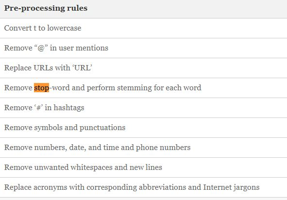

This baseline method is based off of the one found in [this](https://realpython.com/python-keras-text-classification/) tutorial.

```python cnn_base.py``` in the command line to run the program.

Notes:
- this uses the pre-trained glove.6B.50d model, which is stored locally to run. The current file path for this is "glove/glove.6B.50d.txt" which may need to be adjusted/downloaded to run on a different machine.
- currently has the accuracy plot and model summary details displaying. This can be disabled by commenting out ```plt.show()``` and ```model.summary()``` respectively.
- this also uses the datasets from the same tutorial, which have been included in the ```data/``` folder. This means the model is running three times; one for each dataset.
- this model is not currently set up  to run on GPUs. (Mainly due to difficulties working with the cuda library versions on ecs machines)


#### Pretraining a GloVe corpus

One of the avenues I explored in improving the model was training my own GloVe model. This involves creating a text file, which can be generated by running ```python glove_prep.py``` in the console. This will generate a file called: ```full_pandata_corpus.txt```.

Next to train the model, the glove repository is needed:
- ```git clone https://github.com/stanfordnlp/GloVe.git``` in console

Next you need to modify the ```./demo.sh``` file in the GloVe repository.
- set CORPUS=full_pandata_corpus.txt
- change the line```if [ "$CORPUS" = 'text8' ]; then``` to ```if [ "$CORPUS" = 'full_pandata_corpus.txt' ]; then```
- remove the initial ```if``` script directly after ```make```

Finally run the script.
- ```cd GloVe```
- build: ```make``` in console
- and run: ```./demo.sh``` in console


##### Corpus breakdown:
- original glove file: 51.73
- full_corp_min_1 : **76.56**
- full_corp_min_2 : **60.86**
- full_corp_min_3 : **57.49**
- full_corp_min_4 : **55.37**
- full_corp_min_5 : **53.65**
- train_only_100_min_1 : **74.19**
- train_only_100_min_2 : 29.7
- train_only_100_min_3 : 19.64
- train_only_100_min_4 : 14.88
- train_only_100_min_5 : 11.96


Instructions

### Part 1

Can be found in submissions folder.
Running on amazon, yelp and imdb data.

### Part 2:

Note: for the sake of time and simplicity this model is only being tested on the first 100 files in the pandata dataset.

Slight changes made to baseline method:
  - Model is now using ```categorical_crossentropy``` as the loss function, due to there now being three classes (```binary_crossentropy``` would no longer make sense).
  - Output layer in model is now of size 3, reflective of this new loss function.
  - split test data into validation and test data (so model isnt learning via test)

##### Performance (no val):


<!-- ##### Performance (val):
 -->

##### Model:


### Part 3:

##### pre-processing:
- https://link-springer-com.helicon.vuw.ac.nz/chapter/10.1007%2F978-981-15-5558-9_17
- Tweet Classification Using Deep Learning Approach to Predict Sensitive Personal Data



##### obvious issues:
- overtraining on data
- Percent of vocabulary covered by GloVe: 0.5173520077273355

##### Changes made:


##### Performance:
