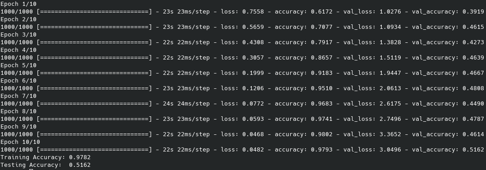
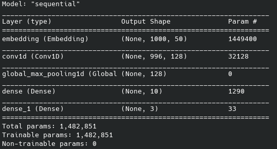

This baseline method is based off of the one found in [this](https://realpython.com/python-keras-text-classification/) tutorial.

```python cnn_base.py``` in the command line to run the program.

Notes:
- this uses the pre-trained glove.6B.50d model, which is stored locally to run. The current file path for this is "glove/glove.6B.50d.txt" which may need to be adjusted/downloaded to run on a different machine.
- currently has the accuracy plot and model summary details displaying. This can be disabled by commenting out ```plt.show()``` and ```model.summary()``` respectively.
- this also uses the datasets from the same tutorial, which have been included in the ```data/``` folder. This means the model is running three times; one for each dataset.
- this model is not currently set up  to run on GPUs. (Mainly due to difficulties working with the cuda library versions on ecs machines)


TODO:
- investigate emoji handling fictionary from [this](https://studymachinelearning.com/text-preprocessing-handle-emoji-emoticon/) website.


### Part 1

Can be found in submissions folder.
Running on amazon, yelp and imdb data.

### Part 2:

Note: for the sake of time and simplicity this model is only being tested on the first 100 files in the pandata dataset.

Slight changes made to baseline method:
  - Model is now using ```categorical_crossentropy``` as the loss function, due to there now being three classes (```binary_crossentropy``` would no longer make sense).
  - Output layer in model is now of size 3, reflective of this new loss function.
  - split test data into validation and test data (so model isnt learning via test)

##### Performance (no val):


<!-- ##### Performance (val):
 -->

##### Model:



### Part 3:

##### obvious issues:
- overtraining on data
- Percent of vocabulary covered by GloVe: 0.5173520077273355

##### Changes made:


##### Performance:
